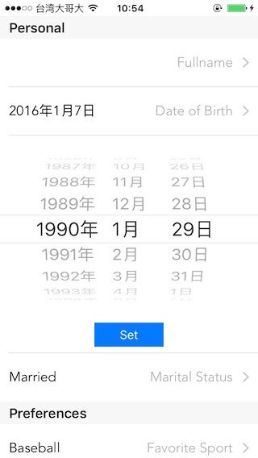
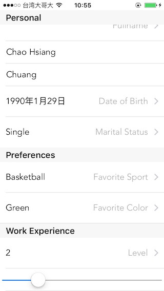

# AppCoda_ExpandableUITableView

Screenshot
-----------

Reference
-----------
[AppCoda: How To Create an Expandable Table View in iOS ](http://www.appcoda.com/expandable-table-view/) 

[AppCoda中文版：如何在 iOS Apps 創建展開式 UITableView ](http://www.appcoda.com.tw/expandable-table-view/)
